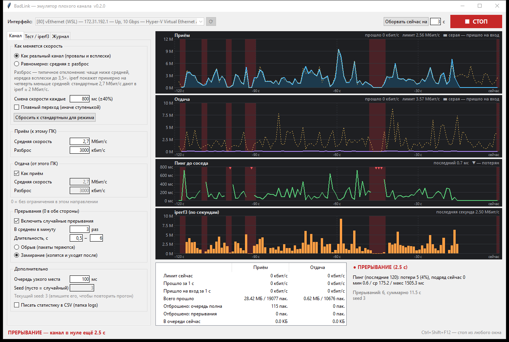

# BadLink — эмулятор плохого канала для стенда

Зажимает реальный сетевой интерфейс Windows до условий плохого on-prem канала, чтобы отлаживать
софт и железки на очереди, отвалы и переподключения.



- **Весь IP-трафик выбранного интерфейса**, без исключений.
- **Приём и отдача раздельно:** средняя скорость + разброс; скорость случайно меняется ~раз в секунду.
- **Два режима изменения скорости**, у каждого свои стандартные настройки (кнопка «Сбросить к стандартным для режима»):
  - *как реальный канал* (по умолчанию) — логнормально: чаще ниже средней, изредка всплески до 3,5×;
  - *равномерно* — в пределах средняя ± разброс.
- **Прерывания:** случайно N раз в минуту, скорость 0 в обе стороны; короткие частые, длинные редкие.
  Плюс кнопка «Оборвать сейчас».
  - *обрыв* — пакеты теряются (TCP уходит в ретрансмиты с удвоением таймаута: провал 1,3 с даёт 2–3 нуля в iperf);
  - *замирание* — пакеты копятся и уходят после восстановления (в iperf — всплеск после нуля).
- **Seed:** повторяет ту же последовательность скоростей и расписание прерываний.
- **Встроенный iperf3:** сервер поднимается при запуске (порт 5201), клиент рисует скорость по секундам.
- **Статистика:** графики приёма/отдачи (факт, лимит, что пришло на вход), пинг до соседа, iperf, счётчики отбросов, CSV-лог.
- **Стоп:** кнопка или **Ctrl+Shift+F12** из любого окна. При остановке или падении программы перехват
  снимается драйвером, и канал сразу работает на полной скорости.

## Установка и запуск

1. Скачайте `BadLink-<версия>.zip` со страницы [Releases](https://github.com/rz6hkh/badlink/releases)
   (свежая сборка с `main` — в артефактах последнего запуска [Actions](https://github.com/rz6hkh/badlink/actions)).
2. Распакуйте в любую папку. Python не нужен: драйвер WinDivert и iperf3 лежат рядом с exe.
3. Запустите `BadLink.exe`. Он сам запросит права администратора (без них перехват невозможен).

Настройки сохраняются в `settings.json` рядом с exe, CSV-логи — в `logs\`. Папку можно копировать
между машинами стенда вместе с настройками.

Ключи командной строки:

| ключ | что делает |
|---|---|
| `--start` | сразу включить эмуляцию с сохранёнными настройками |
| `--iperf` | вместе с `--start`: сразу запустить iperf3-клиент к соседу |
| `--settings <файл>` | взять настройки из другого файла (профили стендов) |
| `--selftest` | самопроверка без перехвата трафика, результат в `selftest.log`, код возврата 0 — успех |

`--start` включает эмуляцию **только** на интерфейсе, сохранённом в настройках; если его нет — не запускается.

Пример — профиль стенда с автозапуском:

```bash
BadLink.exe --settings stand-a.json --start
```

## Стандартные настройки

| | как реальный канал | равномерно |
|---|---|---|
| средняя скорость (приём = отдача) | 2,7 Мбит/с | 1,5 Мбит/с |
| разброс | 3000 кбит/с (типичное отклонение) | ±500 кбит/с |
| смена скорости | каждые ~800 мс | каждые ~1000 мс |
| прерывания | вкл., 3 в минуту, 0,5–6 с, замирание | выкл. (2 в минуту, 1–5 с, обрыв) |
| очередь узкого места | 100 мс | 100 мс |

Режим «как реальный канал» подогнан по замерам `iperf3 -R` на объекте (итог ~1,5–2,7 Мбит/с, секунды от 0
до ~8 Мбит/с, одиночные нули и изредка серии по 5). На стенде со стандартными настройками `iperf3 -R -t 90 -l 8K`
даёт в среднем ~2 Мбит/с: медиана ~1,6, 90% секунд ниже ~4,3, нулевых секунд ~9%, серии нулей 1, 1, 1, 1, 4.
Средняя в настройках выше, чем покажет iperf: всплески ограничены 3,5× средней, а TCP не выбирает канал полностью.

## Важно знать

- **iperf3 на Windows и низкие скорости.** С блоком по умолчанию (128 КБ) Windows-сборка iperf3 на
  скоростях порядка 1–2 Мбит/с показывает по секундам ступеньки 1,05 / 2,1 / 0 Мбит/с, даже если реальная скорость
  ровная. Используйте `-l 8K`: `iperf3 -c <IP> -R -t 90 -l 8K`. Во встроенном клиенте это значение по умолчанию.
- **Суперпакеты (LSO/RSC).** Сетевые карты склеивают TCP-сегменты до 64 КБ. Программа режет их обратно
  до MTU 1500, иначе на 1,5 Мбит/с один такой пакет «передавался» бы ~350 мс и график рвался бы.
- **Очередь узкого места.** Маленькая очередь (100 мс) при пачках от отправителя даёт отбросы и недобор
  скорости TCP (на стенде: 70% лимита на отдаче при 100 мс, 84% при 300 мс). Это поведение реального
  узкого места с маленьким буфером. Размер настраивается в «Дополнительно».
- **Не эмулируется:** трафик внутри одного ПК (loopback) и протоколы ниже IP (сырой Ethernet, Profinet RT и т.п.).
- **Производительность:** рассчитано на лимиты до ~20 Мбит/с. Входящий поток выше лимита программа всё равно
  принимает и отбрасывает, поэтому сотни Мбит/с UDP нагрузят одно ядро CPU.
- **Антивирусы.** WinDivert — драйвер ядра; некоторые антивирусы/EDR помечают его как RiskTool.
  На корпоративных машинах стенда согласуйте утилиту с ИБ заранее.

## Как устроено

```
пакет с интерфейса ─► WinDivert ─► [нарезка суперпакетов до MTU]
      ─► прерывание? (обрыв: отброс / замирание: в очередь)
      ─► очередь узкого места (drop-tail, по умолчанию 100 мс на базовой скорости)
      ─► ограничитель скорости (token bucket, корзина ~10 мс)
      ─► обратно в сеть / в стек
```

## Разработка

Нужен Python 3.10+ x64 (сторонних пакетов для работы нет). Запуск из исходников — `python main.py`
(ключ `--no-elevate` — не запрашивать права администратора).

```bash
python -m unittest discover -s tests -v
```

```bash
powershell -ExecutionPolicy Bypass -File build.ps1
```

`build.ps1` (нужен `pip install pyinstaller`) собирает `dist\BadLink\BadLink.exe`, прогоняет на нём `--selftest`
и упаковывает `dist\BadLink-<версия>.zip`.

**CI (GitHub Actions):** на каждый push и PR — ruff, тесты, самопроверка, сборка exe (архив в артефактах запуска).
На тег `vX.Y.Z` — дополнительно GitHub Release с архивом. Тег должен совпадать с `__version__` в `netem/__init__.py`.

Переменная окружения `BADLINK_EXTRA_FILTER` сужает перехват (только для отладки), например
`set BADLINK_EXTRA_FILTER=ip.DstAddr == 10.0.0.5 or ip.SrcAddr == 10.0.0.5`.

```
main.py                точка входа
netem/engine.py        модель канала: очередь, token bucket, качание скорости, прерывания
netem/windivert.py     ctypes-обёртка WinDivert 2.2 + нарезка LSO/RSC-суперпакетов
netem/sysinfo.py       интерфейсы, счётчики ОС, ICMP-пинг с IP интерфейса, горячая клавиша, фильтр
netem/iperf.py         iperf3-сервер (автоперезапуск) и клиент (разбор вывода по секундам)
netem/chart.py         графики на tk.Canvas
netem/gui.py           окно
netem/selftest.py      самопроверка для CI и собранного exe
windivert/             WinDivert 2.2.2 (x64): WinDivert.dll, WinDivert64.sys, LICENSE (LGPLv3)
iperf3/                iperf3 3.21 для Windows (сборка ar51an/iperf3-win-builds, BSD) + cygwin1.dll (LGPLv3)
```

## Лицензия

Код BadLink — MIT ([LICENSE](LICENSE)). Сторонние компоненты и их лицензии — [THIRD_PARTY.md](THIRD_PARTY.md).
